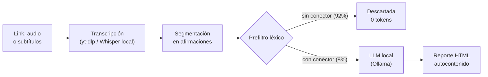

# Linguistical Speech Analytics

[](https://github.com/kaledoviedoo/linguistical-speech-analytics/actions/workflows/ci.yml)
[](https://nodejs.org)
[](https://www.typescriptlang.org/)
[](https://ollama.com)
[](#stack-tecnológico)
[](LICENSE)

Audita la **estructura** de un discurso político o económico: detecta afirmaciones causales fuertes que no traen los marcadores que las harían defendibles (comparación, contrafactual o plazo razonable).

No verifica hechos. Verifica cómo está construido el argumento, y todo corre en tu máquina.

## Demo visual



El prefiltro descarta entre el 92% y el 98% del texto sin gastar un token, que es lo que hace viable ejecutar el análisis en CPU. El reporte es un único archivo HTML que se abre con `file://`, sin servidor.

## Stack tecnológico

| Capa | Herramienta |
|---|---|
| Lenguaje | TypeScript estricto sobre Node.js 22 (ESM, sin paso de build, se ejecuta con `tsx`) |
| Inferencia | Ollama local, `qwen2.5:3b` por defecto |
| Transcripción | `@xenova/transformers` (Whisper ONNX, en proceso) + ffmpeg |
| Ingesta | yt-dlp como subproceso local |
| Detección de idioma | `franc` |
| Persistencia | Archivos planos en `./data/<hash>/` |
| Salida | HTML autocontenido en `./reportes/` |
| CI | GitHub Actions (Ubuntu y Windows, Node 20 y 22) |

Sin servidor, sin base de datos, sin claves de API, sin llamadas a la nube.

## Features

- **Dos criterios de auditoría**: framing causal y apelación a autoridad no verificable. Agregar uno nuevo es escribir una carpeta y una línea en el registro.
- **Score derivado y determinista** en el criterio causal, porque el modelo colapsaba la escala (13 de 22 respuestas en 0.85). Derivarlo subió el acierto de 68% a 91%.
- **Prefiltro léxico multiidioma** (275 conectores causales en 6 idiomas, 70 marcadores de autoridad en 4).
- **Elección de pista de subtítulos en el idioma original**: nunca analiza una traducción automática de YouTube.
- **Desolapado de subtítulos automáticos**, que llegan con cada frase repetida dos o tres veces.
- **Segmentación por pausas** cuando la transcripción no trae puntuación.
- **Herramientas de medición incluidas**: recall del prefiltro, latencia desglosada y comparación de modelos.
- **155 tests offline** que no necesitan Ollama ni red, más un arnés que valida cada criterio contra su conjunto de control (91% de exactitud por campo en la última medición).

## Getting started

Requisitos: Node.js 18.17+, Ollama, y opcionalmente ffmpeg (audio y video) y yt-dlp (links).

```bash
git clone https://github.com/kaledoviedoo/linguistical-speech-analytics.git
cd linguistical-speech-analytics
npm install
```

```bash
ollama serve          # en otra terminal
ollama pull qwen2.5:3b
npm run verificar-entorno
```

En Windows, PowerShell bloquea `npm.ps1`, así que el repositorio trae wrappers `.cmd` que lo evitan (no hace falta cambiar ninguna política ni ser administrador):

```powershell
.\instalar.cmd
.\verificar.cmd
```

Después de instalar Node u Ollama, cierra y vuelve a abrir la terminal para que el PATH los tome.

## Ejemplos de uso

```bash
# Subtítulos locales
npm run analizar -- tests/fixtures/discurso-es.srt

# Link de YouTube, usando los subtítulos publicados en vez de transcribir
npm run analizar -- "https://www.youtube.com/watch?v=XXXX" --preferir-subtitulos

# Audio local, forzando el idioma
npm run analizar -- ./discurso.mp3 --idioma es

# El otro criterio, con umbral más bajo
npm run analizar -- ./discurso.srt --criterio apelacion-autoridad --umbral 0.6
```

Comandos de diagnóstico y medición:

```bash
npm run test:pipeline    # 155 tests offline
npm run test:prompt      # valida el criterio contra su conjunto de control
npm run benchmark        # tok/s reales de esta máquina
npm run latencia         # reparte el tiempo entre prompt y generación
npm run medir -- <archivo>   # cuánto se pierde el prefiltro
npm run comparar         # compara varios modelos y arma la tabla
```

Salida típica:

```
[3] Segmentando en afirmaciones y aplicando el prefiltro del criterio...
OK    376 afirmaciones; 30 tienen marcadores del criterio y van al modelo.
[4] Evaluando "Framing causal" con qwen2.5:3b...
      [########################] 100%  30/30  10.3 tok/s
OK    30 evaluadas en 87.0 s. 3 sobre el umbral 0.7.
[5] Generando reporte HTML autocontenido...
```

`npm run analizar -- --ayuda` lista todas las opciones.

## Estructura de directorios

```
src/
  cli.ts                 Punto de entrada y modos de diagnóstico
  pipeline.ts            Orquestador de las cinco etapas
  config.ts              Constantes y versiones de caché
  criterios/             Un criterio = prompt + esquema + gate léxico + presentación
    framing-causal/
    apelacion-autoridad/
  ingesta/               Links (yt-dlp), audio (ffmpeg) y subtítulos
  procesamiento/         Idioma, segmentación y prefiltro
  motor/                 Cliente de Ollama, caché y bucle de evaluación
  analisis/              Métricas y medición del recall
  reporte/               Generación del HTML autocontenido
  utilidades/            Log, rutas y subprocesos
tests/
  eval_pipeline.ts       155 tests offline
  eval_prompt.ts         Validación del criterio contra Ollama
  comparar_modelos.ts    Tabla comparativa de modelos
  medir_latencia.ts      Desglose del tiempo por llamada
  afirmaciones-*.ts      Conjuntos de control anotados
  fixtures/              Subtítulos de prueba
data/                    Salida de cada etapa (no versionado)
reportes/                HTML generados (no versionado)
```

Las decisiones de diseño están en [ARQUITECTURA.md](ARQUITECTURA.md) y el estado de cada fase, con sus mediciones, en [ROADMAP.md](ROADMAP.md).

## Alcance

El sistema audita la **estructura del argumento**, no la veracidad del hecho. Fuera de alcance de forma permanente: fact-checking, traducción automática, servidores persistentes y APIs en la nube.

## Contacto

**Kaled Oviedo** · [@kaledoviedoo](https://instagram.com/kaledoviedoo) en Instagram · [github.com/kaledoviedoo](https://github.com/kaledoviedoo)
